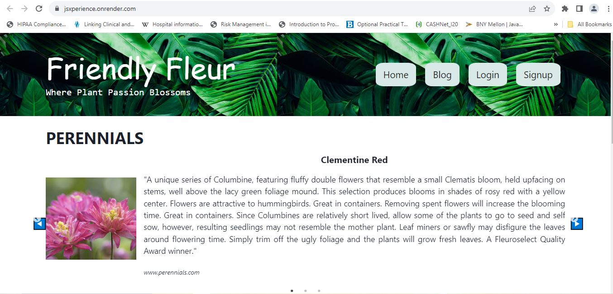

# Friendly Fleur

My motivation behind creating this app was to provide platform for plant lovers. Friendly Fleur is a dynamic and interactive platform that brings together green thumbs from all around the globe to share their passion for greenery. With state-of-the-art tech like React and Mongo, graphql and JWT authentication providing a secure environment, Friendly Fleur is a one-stop for all things botanical.

## Description

  ## Github Repo link: 
  https://github.com/Nehaps29/jsxperience

  ## Deployed Link:

  https://jsxperience.onrender.com/

  ## App Image:
  

  ## Table of Content

  - [Installation](#installation)
  - [Usage](#usage)
  - [Contribution Details](#contribution-details)
  - [Test Instructions](#test-instructions) 
  - [License](#licenses)
  - [Contact](#contact)
  
  

  ## Installation: 
  - npm i
  - npm run seed
  - npm run develop

  ## Usage:
  
  Friendly Fleur is is dedicated to exploring the fascinating world of plants. From practical gardening tips to in-depth plant profiles, our goal is to share valuable information and foster a sense of community among plant lovers. We believe that everyone can experience the joy of nurturing and cultivating greenery, whether you have a sprawling garden or a few potted plants on your windowsill.

  ## Contribution Details: 
  Neha Sabannavar, Crystal Green, Lina Errico, Eric Coteron, Rutger's TA, Class Activities  

  ## Licenses: 
  MIT
      
  https://opensource.org/licenses/MIT 

  This project is licensed under the MIT License. Feel free to fork, modify, and share the content, but please credit the Friendly Fleur Blog and its contributors.

  
  ## Contact: 
  Below mentioned is our github profile links 

  ## Github: 
  https://github.com/nehaps29 | https://github.com/coterone | https://github.com/LMErrico | https://github.com/crissyg923

  
  
